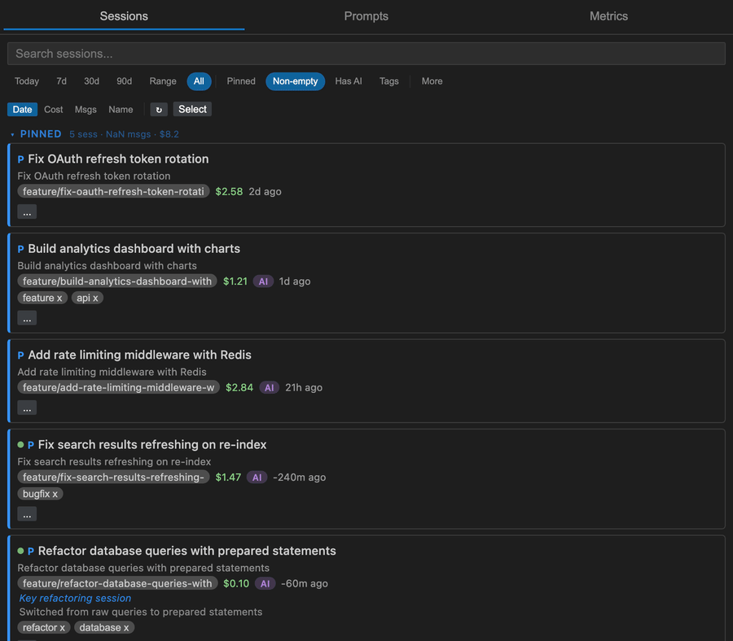
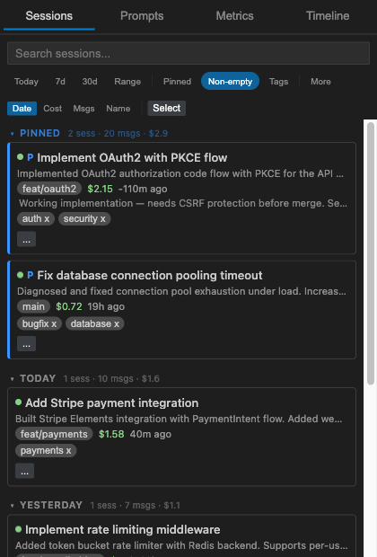
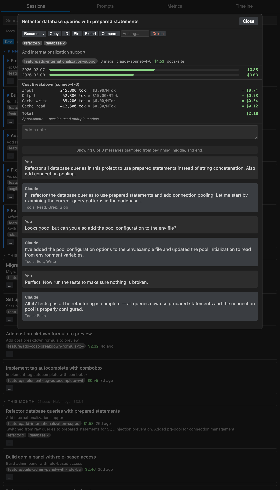
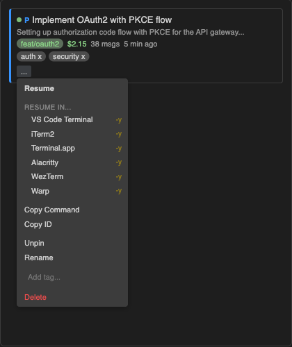
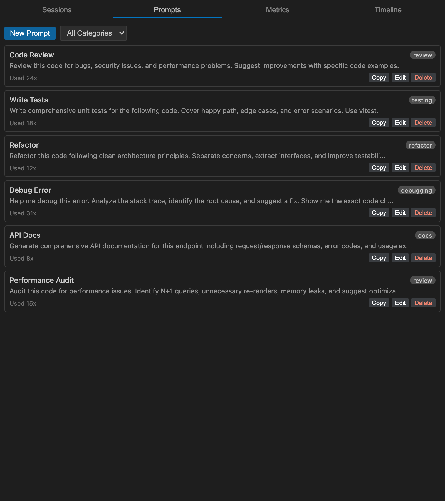
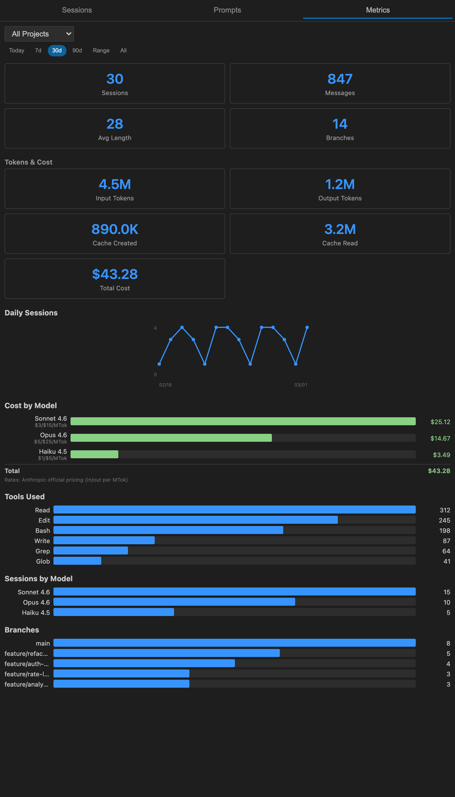

# Claude Cockpit

> You've run hundreds of Claude Code sessions. Good luck finding the one that had that working OAuth implementation.

**Claude Cockpit** is a VS Code sidebar that turns your scattered Claude Code history into a searchable, taggable, resumable dashboard — with AI-powered insights, prompt refinement, and cost tracking built in.

## Features

### Session Dashboard

Every session Claude Code has ever run lives here — searchable, filterable, and grouped by date.
Multi-word fuzzy search highlights matches across session names, messages, branches, and file paths.
Filter by project, git branch, date range, cost, or AI insights status, and sort by date, cost, or message count.
Sessions are automatically discovered from `~/.claude/projects/` and indexed in the background.
Hit the refresh button to manually re-index at any time.

### AI Session Insights

Generate AI-powered summaries, megaprompts, and insights for any session — directly in the preview panel.
Choose your model (Opus, Sonnet, or Haiku) and Claude analyzes the full conversation to produce:

- **Summary** — What happened in the session, key decisions, and outcomes
- **Megaprompt** — A reusable prompt that captures the session's approach and patterns
- **Insights** — Lessons learned, what worked well, and what could improve

Results are cached in SQLite with staleness detection — when a session gets new messages, insights are automatically marked for refresh.
Sessions with generated insights show an **AI** badge on their card for quick identification.

### Quick Resume — 7+ Terminals

Spotted the session you need? Resume it without leaving VS Code, or launch it directly in your preferred terminal.
Claude Cockpit supports eight terminals out of the box, each with both standard resume and auto-approve modes.

| Terminal         | Resume | Auto-approve |
|------------------|:------:|:------------:|
| VS Code terminal | ✓      | ✓            |
| iTerm2           | ✓      | ✓            |
| WezTerm          | ✓      | ✓            |
| Kitty            | ✓      | ✓            |
| Ghostty          | ✓      | ✓            |
| Terminal.app     | ✓      | ✓            |
| Alacritty        | ✓      | ✓            |
| Warp             | ✓      | ✓            |

### Prompt Library & AI Refinement

Save prompt templates, organize by category, and launch new Claude Code sessions with a single click.
Use AI-powered refinement to optimize your prompts with six specialized flavors:

- **Token Efficient** — Compress and remove filler
- **Speed Optimized** — Single-pass, no follow-up needed
- **Quality Maximized** — Chain-of-thought, examples, and rubric
- **Structured** — XML tags and numbered steps
- **Expert Persona** — Domain expert framing
- **All Combined** — Balanced optimization

Refine recursively — feed the output back in for further optimization.
Add custom instructions to guide the refinement, and save refined prompts directly to your library.

### Usage Metrics & Cost Tracking

Claude Code doesn't tell you what you're spending. Claude Cockpit does.
Every API call is priced using Anthropic's official rates — including cache token savings — so the numbers you see are the numbers you pay.
Click any session's cost to see the full formula: tokens × rate = cost, broken down by input, output, cache write, and cache read.
The metrics dashboard tracks spending by model with rates shown inline, so you can verify every dollar.

### Also included

- **Pin & Tag** — Pin important sessions to the top, add custom tags for instant retrieval
- **Tag Autocomplete** — Existing tags are suggested as you type
- **Session Notes** — Annotate sessions with context your future self will thank you for
- **Session Preview** — Full conversation preview with cost formula, sampled messages, and notes
- **AI Insight Indicators** — Sessions with generated insights show an AI badge on their card
- **Has AI Filter** — Filter sessions to show only those with AI insights
- **Refresh Button** — Manual re-indexing when you want immediate updates
- **Session ID Search** — Paste a session UUID (or just the first few characters) to find it instantly
- **Cross-Device Sync** — Pins, tags, notes, and prompts sync across machines via VS Code Settings Sync
- **Keyboard Shortcuts** — Navigate with arrow keys, `r` to resume, `p` to pin, `Ctrl+K` to search
- **Export / Import** — Back up all your data to JSON and restore it anywhere

## Quick Start

1. Install [Claude Cockpit](https://marketplace.visualstudio.com/items?itemName=yurman.claude-cockpit) from the VS Code Marketplace
2. Run `claude` in your terminal to create some sessions
3. Click the cockpit icon in the activity bar to open the dashboard

The extension automatically discovers sessions from `~/.claude/projects/` and indexes them in the background.
No configuration required.

## Commands & Shortcuts

| Command                            | Shortcut       | Description                             |
|------------------------------------|----------------|-----------------------------------------|
| Claude Cockpit: Open Dashboard     | `Cmd+Shift+K`  | Open the session dashboard              |
| Claude Cockpit: Quick Resume       | `Cmd+Shift+R`  | Pick and resume a session               |
| Claude Cockpit: Resume Last Pinned |                 | Resume the most recently pinned session |
| Claude Cockpit: Save Prompt        |                 | Save a new prompt template              |
| Claude Cockpit: Export All Data    |                 | Export pins, tags, and prompts to JSON  |
| Claude Cockpit: Import Data        |                 | Import from a backup JSON file          |

> On Linux/Windows, replace `Cmd` with `Ctrl`.

## Requirements

- VS Code 1.109+
- [Claude Code](https://docs.anthropic.com/en/docs/claude-code) CLI installed

## License

MIT
