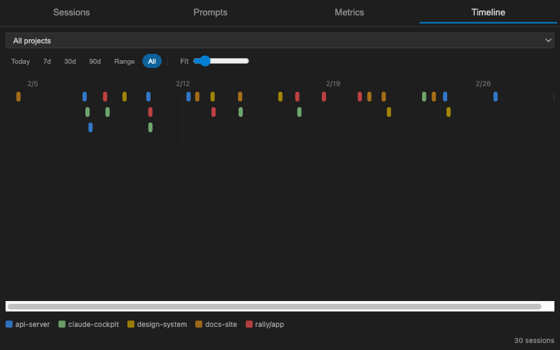

# Claude Cockpit

> You've run hundreds of Claude Code sessions. Good luck finding the one that had that working OAuth implementation.

**Claude Cockpit** is a VS Code sidebar that turns your scattered Claude Code history into a searchable, taggable, resumable dashboard — so you never lose track of what Claude built for you.

## Features

### Session Dashboard

Every session Claude Code has ever run lives here — searchable, filterable, and grouped by date.
Multi-word fuzzy search highlights matches across session names, messages, branches, and file paths.
Filter by project, git branch, date range, or cost, and sort by date, cost, or message count.
Sessions are automatically discovered from `~/.claude/projects/` and indexed in the background.

### Quick Resume — 6 Terminals

Spotted the session you need? Resume it without leaving VS Code, or launch it directly in your preferred terminal.
Claude Cockpit supports six terminals out of the box, each with both standard resume and auto-approve modes.
No more copying session IDs and typing `claude --resume` by hand.

| Terminal         | Resume | Auto-approve |
|------------------|:------:|:------------:|
| VS Code terminal | yes    | yes          |
| iTerm2           | yes    | yes          |
| Terminal.app     | yes    | yes          |
| Alacritty        | yes    | yes          |
| WezTerm          | yes    | yes          |
| Warp             | yes    | yes          |

### Usage Metrics & Cost Tracking

Claude Code doesn't tell you what you're spending. Claude Cockpit does.
Every API call is priced using Anthropic's official rates — including cache token savings — so the numbers you see are the numbers you pay.
Click any session's cost to see the full formula: tokens × rate = cost, broken down by input, output, cache write, and cache read.
The metrics dashboard tracks spending by model with rates shown inline, so you can verify every dollar.

### Prompt Library

Stop re-typing the same instructions every time you start a new session.
Save prompt templates, organize them, and launch new Claude Code sessions with a single click.
Build a library of your best-performing prompts so you can reuse what works.

### Timeline View

See when you actually use Claude Code.
The timeline plots your session activity over days and weeks so you can spot patterns in your AI-assisted workflow.

### Also included

- **Pin & Tag** — Pin important sessions to the top, add custom tags for instant retrieval
- **Session Notes** — Annotate sessions with context your future self will thank you for
- **Session Preview** — Full conversation preview with cost formula, sampled messages, and notes
- **Session ID Search** — Paste a session UUID (or just the first few characters) to find it instantly
- **Cross-Device Sync** — Pins, tags, notes, and prompts sync across machines via VS Code Settings Sync
- **Keyboard Shortcuts** — Navigate with arrow keys, `r` to resume, `p` to pin, `Ctrl+K` to search
- **Export / Import** — Back up all your data to JSON and restore it anywhere

## Quick Start

1. Install [Claude Cockpit](https://marketplace.visualstudio.com/items?itemName=yurman.claude-cockpit) from the VS Code Marketplace
2. Run `claude` in your terminal to create some sessions
3. Click the cockpit icon in the activity bar to open the dashboard

The extension automatically discovers sessions from `~/.claude/projects/` and indexes them in the background.
No configuration required.

## Commands & Shortcuts

| Command                            | Shortcut       | Description                             |
|------------------------------------|----------------|-----------------------------------------|
| Claude Cockpit: Open Dashboard     | `Cmd+Shift+K`  | Open the session dashboard              |
| Claude Cockpit: Quick Resume       | `Cmd+Shift+R`  | Pick and resume a session               |
| Claude Cockpit: Resume Last Pinned |                 | Resume the most recently pinned session |
| Claude Cockpit: Save Prompt        |                 | Save a new prompt template              |
| Claude Cockpit: Export All Data    |                 | Export pins, tags, and prompts to JSON  |
| Claude Cockpit: Import Data        |                 | Import from a backup JSON file          |

> On Linux/Windows, replace `Cmd` with `Ctrl`.

## Requirements

- VS Code 1.109+
- [Claude Code](https://docs.anthropic.com/en/docs/claude-code) CLI installed

## License

MIT
